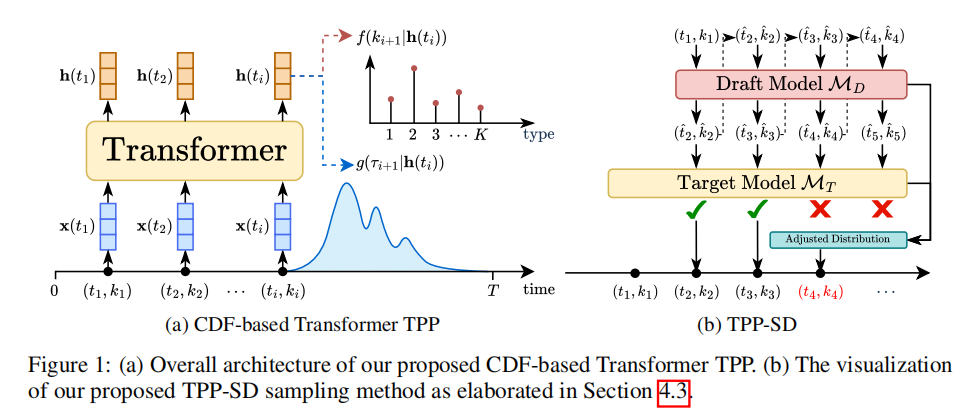

# TPP-SD: Accelerating Transformer Point Process Sampling with Speculative Decoding

[](https://www.python.org/)
[](https://pytorch.org/)

A PyTorch implementation of the paper **"TPP-SD: Accelerating Transformer Point Process Sampling with Speculative Decoding"**.

## 🔥 News
2025/10 💥 TPP-SD is accepted by NeurIPS 2025！！🎉🎉

## 📋 Table of Contents

- [TPP-SD: Accelerating Transformer Point Process Sampling with Speculative Decoding](#tpp-sd-accelerating-transformer-point-process-sampling-with-speculative-decoding)
  - [📋 Table of Contents](#-table-of-contents)
  - [🎯 Overview](#-overview)
  - [✨ Features](#-features)
  - [🛠️ Installation](#️-installation)
    - [Prerequisites](#prerequisites)
    - [Environment Setup](#environment-setup)
  - [🚀 Usage](#-usage)
    - [Dataset Generation](#dataset-generation)
    - [Model Training](#model-training)
    - [Speculative Decoding](#speculative-decoding)
  - [📊 Results](#-results)
  - [🏗️ Project Structure](#️-project-structure)
  - [🤝 Contributing](#-contributing)
  - [📄 License](#-license)
  - [📚 Citation](#-citation)

## 🎯 Overview

TPP-SD introduces an innovative approach to accelerate sampling in Transformer-based Point Process models using speculative decoding techniques. This implementation provides efficient sampling for various temporal point process models while maintaining high accuracy.



## ✨ Features

- 🚀 **Accelerated Sampling**: Speculative decoding for faster point process sampling
- 🔬 **Multiple Process Types**: Support for Poisson, Uni-variate Hawkes, and Multi-variate Hawkes processes
- 🏗️ **Flexible Architecture**: Multiple encoder options (THP, SAHP, AttNHP)
- 📊 **Comprehensive Evaluation**: Likelihood comparison, KS plots, and sampling analysis
- 🔧 **Configurable Training**: YAML-based configuration system

## 🛠️ Installation

### Prerequisites

- Python 3.9+
- Conda (recommended)

### Environment Setup

Create and activate a new conda environment:

```bash
# Create environment
conda create -n tpp-sd python=3.9

# Activate environment
conda activate tpp-sd

# Install dependencies
pip install -r requirements.txt
```

## 🚀 Usage

### Dataset Generation

Generate synthetic datasets for different point process types:

```bash
cd code

# Modify parameters in generate_dataset.py as needed
python generate_dataset.py
```

**Supported Process Types:**
- **Poisson Process**: Homogeneous and inhomogeneous variants
- **Uni-variate Hawkes Process**: Self-exciting point processes
- **Multi-variate Hawkes Process**: Multi-dimensional temporal processes

Generated datasets are saved to `data/synth/` by default.

### Model Training

Train transformer-based point process models:

```bash
cd code

# Train on different datasets
python train.py --config scripts/train_config_inhomo_poi.yaml    # Poisson process
python train.py --config scripts/train_config_myhawkes.yaml     # Uni-variate Hawkes
python train.py --config scripts/train_config_multi_hawkes.yaml # Multi-variate Hawkes
```

**Customizable Options:**
- Encoder types: THP, SAHP, AttNHP
- Model hyperparameters
- Mixture components (Log-normal distribution)
- Training configurations via YAML files

### Speculative Decoding

Run accelerated sampling with TPP-SD:

```bash
cd code

# Run speculative decoding experiments
python sd_sampling_exp.py --config scripts/sd_config_inhomo_poi.yaml    # Poisson process
python sd_sampling_exp.py --config scripts/sd_config_myhawkes.yaml     # Uni-variate Hawkes
python sd_sampling_exp.py --config scripts/sd_config_multi_hawkes.yaml # Multi-variate Hawkes
```

## 📊 Results

The implementation generates comprehensive evaluation results:

- **Likelihood Comparison Plots**: Statistical accuracy analysis
- **Kolmogorov-Smirnov (KS) Plots**: Distribution similarity assessment
- **Sampling Comparison Plots**: Performance and speedup visualization

All results are automatically saved to `code/plots/`.

## 🏗️ Project Structure

```
tppsd/
├── code/
│   ├── generate_dataset.py      # Synthetic data generation
│   ├── train.py                 # Model training script
│   ├── sd_sampling_exp.py       # Speculative decoding experiments
│   ├── scripts/                 # Configuration files
│   └── plots/                   # Output plots and results
├── data/
│   └── synth/                   # Generated synthetic datasets
├── image/
│   └── read/                    # Documentation images
├── requirements.txt             # Python dependencies
└── README.md                    # This file
```

## 🤝 Contributing

Contributions are welcome! Please feel free to submit pull requests or open issues for bugs and feature requests.


## 📚 Citation

If you use this code in your research, please cite the original paper:

```bibtex
@article{tpp-sd2024,
  title={TPP-SD: Accelerating Transformer Point Process Sampling with Speculative Decoding},
  author={},
  journal={},
  year={2024}
}
```
